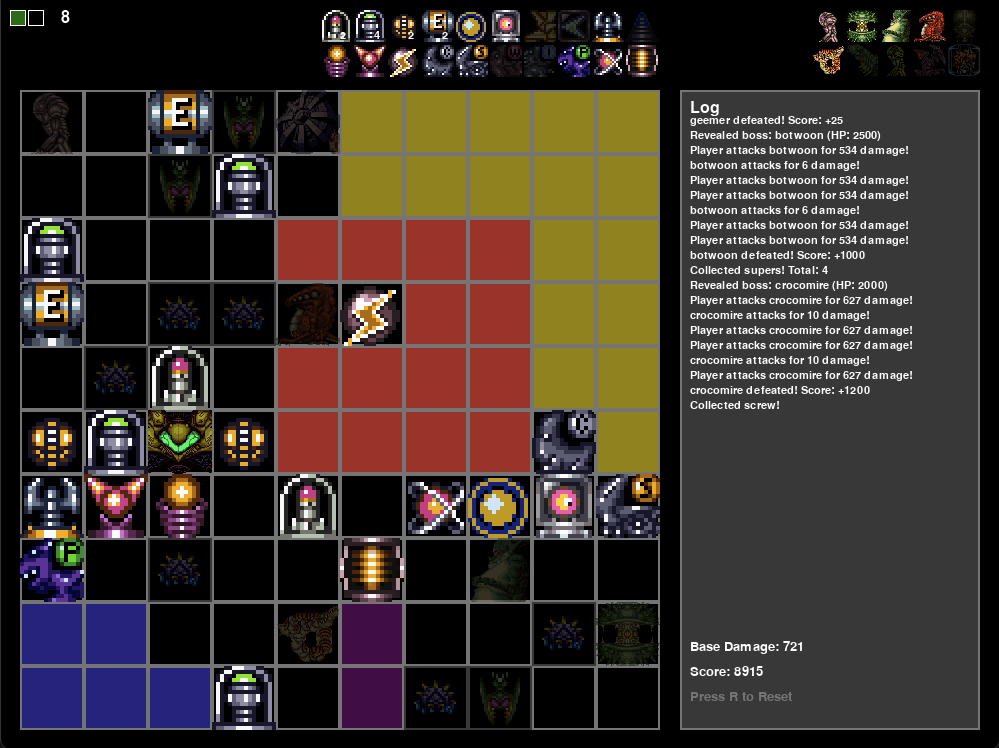
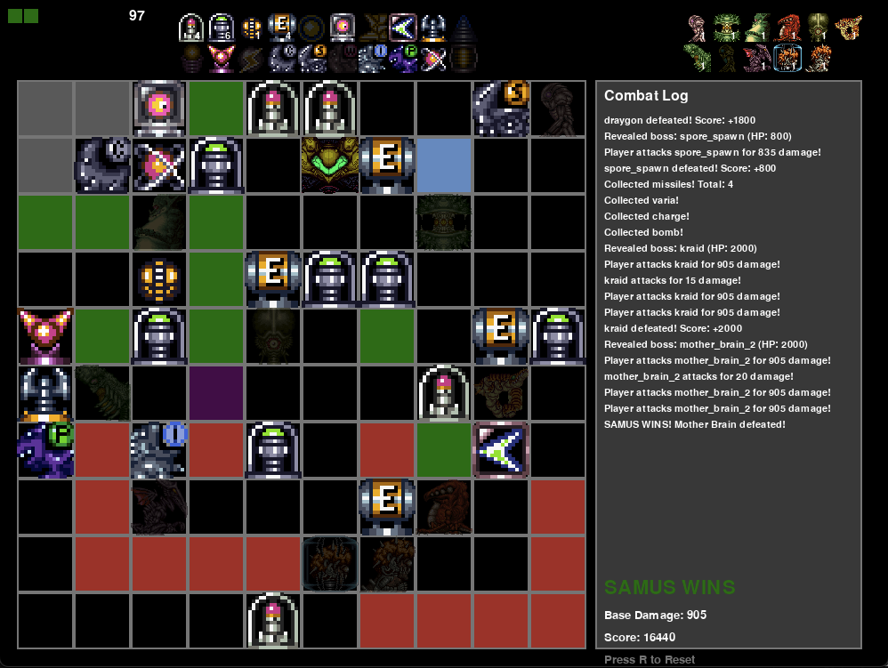
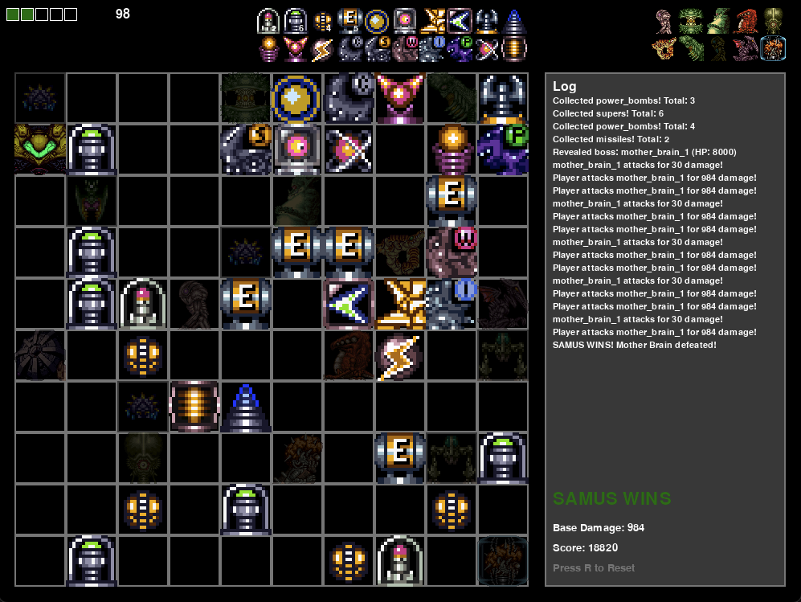
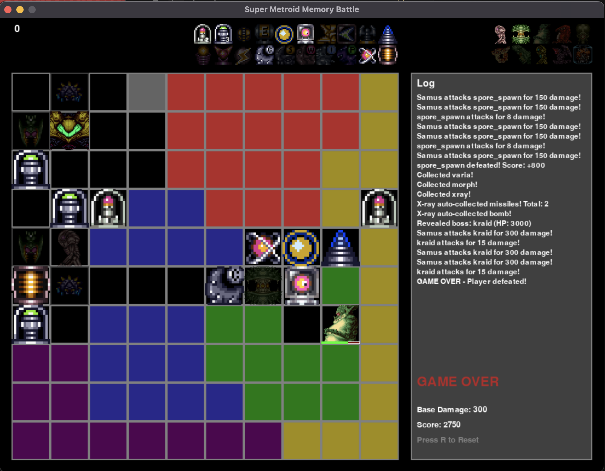

# Super Metroid Memory Battle

A tile-flipping memory game with boss battles and item collection inspired by Super Metroid.

## Screenshots

<p align="center">
  
  
</p>
<p align="center">
  
  
</p>

## Overview

Navigate a 10x10 grid of face-down tiles representing different areas from Super Metroid. Reveal tiles adjacent to already-revealed tiles to collect items, defeat enemies, and ultimately destroy Mother Brain to win!

## Game Mechanics

### Movement
- Click on tiles adjacent to already-revealed tiles to flip them over
- The first tile can be clicked anywhere on the board
- Face-down tiles are color-coded by area type
- You can only move to adjacent tiles (no diagonals)

### Areas
The game features 7 themed areas from Super Metroid:
- **Crateria** (Light Blue) - Starting area with Samus' ship and Bomb Torizo
- **Brinstar** (Green) - Home of Kraid and Spore Spawn
- **Norfair** (Red) - Ridley and Crocomire territory (requires Varia Suit to avoid heat damage)
- **Maridia** (Blue) - Draygon and Botwoon domain (requires Gravity Suit to enter)
- **Tourian** (Yellow) - Mother Brain's lair
- **Wrecked Ship** (Purple) - Phantoon's domain
- **Ceres** (Gray) - Ceres Station

### Area Restrictions
- **Norfair**: Without Varia Suit, you take 25 damage when entering
- **Maridia**: Cannot enter without Gravity Suit

## Combat System

### Energy
- Start with 99 energy
- Energy Tanks add 100 max energy and fully heal you
- Game over if energy reaches 0

### Combat Order
Combat proceeds in turns every second:
1. **Default**: Enemies attack → Bosses attack → Player attacks
2. **With Movement Items**: Chance to attack first before enemies/bosses!

### Attack First Mechanics
Certain items increase your chance to attack before enemies and bosses:
- **Morph Ball**: +25% chance to attack first
- **High Jump Boots**: +25% chance to attack first
- **Spring Ball**: +25% chance to attack first
- **Space Jump**: +25% chance to attack first
- **Speed Booster**: +50% chance to attack first

Stack these items to guarantee first strikes! (caps at 100%)

## Items & Abilities

### Consumables
- **Missiles**: +10 damage per missile
- **Super Missiles**: +20 damage per super missile
- **Power Bombs**: +30 damage per power bomb
- **Energy Tanks**: +100 max energy, fully heals

### Beams & Weapons
- **Charge Beam**: +20 damage
- **Ice Beam**: +20 damage, 10% chance to freeze enemies (they skip a turn)
- **Spazer**: +30 damage
- **Wave Beam**: +20 damage
- **Plasma Beam**: +25 damage

### Movement Items
- **Morph Ball**: +25% attack first chance
- **Bombs**: +50 attack damage 
- **High Jump Boots**: +25% attack first chance
- **Speed Booster**: +20 damage, +50% attack first chance
- **Spring Ball**: +25% attack first chance
- **Space Jump**: +25% attack first chance
- **Screw Attack**: +50 damage

### Utility Items
- **X-ray Scope** (Brinstar): Automatically reveals and collects diagonal item tiles (forming an "X" pattern) when you collect any item!
- **Grapple Beam** (Norfair): 3x damage multiplier against Draygon

### Suits
- **Varia Suit**: +25% damage boost, prevents Norfair heat damage
- **Gravity Suit**: +50% damage boost, allows entry to Maridia

## Bosses

Each area contains unique bosses with varying health and damage:

### Minor Bosses
- **Bomb Torizo** (Crateria) - 800 HP, 5 damage - 500 points
- **Spore Spawn** (Brinstar) - 1200 HP, 8 damage - 800 points
- **Crocomire** (Norfair) - 2000 HP, 10 damage - 1200 points
- **Botwoon** (Maridia) - 2500 HP, 6 damage - 1000 points

### Major Bosses
- **Kraid** (Brinstar) - 3000 HP, 15 damage - 2000 points
- **Phantoon** (Wrecked Ship) - 3500 HP, 12 damage - 1500 points
- **Draygon** (Maridia) - 4000 HP, 20 damage - 1800 points
- **Gold Torizo** (Tourian) - 3000 HP, 18 damage - 1600 points
- **Ridley** (Norfair) - 6000 HP, 25 damage - 2500 points

### Final Boss
- **Mother Brain** (Tourian) - 8000 HP, 30 damage - 5000 points
  - Defeat Mother Brain to win the game!

### Special Boss
- **Ceres Station** (Ceres) - 1000 HP, 4 damage - 600 points
  - Defeating Ceres Station reduces Ridley's health by 1000!

## Enemies

Minor enemies patrol various areas:
- **Geemer** - 50 HP, 3 damage - 25 points
- **Skree** - 75 HP, 4 damage - 35 points
- **Side Hopper** - 100 HP, 5 damage - 50 points
- **Ciser** - 125 HP, 6 damage - 75 points

## Strategy Tips

1. **Collect Energy Tanks early** - More health means more survivability
2. **Grab beam weapons** - They stack for massive damage
3. **Get Varia Suit before exploring Norfair** - Heat damage adds up quickly
4. **Get Gravity Suit to access Maridia** - Important items and bosses await
5. **Collect movement items for attack advantage** - Attacking first can save your life!
6. **Use X-ray Scope wisely** (Brinstar) - Auto-collect diagonal items in an "X" pattern for faster progression
7. **Get Grapple Beam from Norfair** - 3x damage makes Draygon much easier
8. **Defeat Ceres Station early** - Weakens Ridley significantly
9. **Stock up on missiles** - Each one adds damage to every attack
10. **Get Bombs early** (Brinstar) - +50 damage makes a huge difference

## Controls

- **Mouse Click**: Reveal tiles
- **R Key**: Reset game (new random map)
- **Close Window**: Exit game

## Scoring

- Item pickups: 10-400 points depending on rarity
- Enemy defeats: 25-75 points
- Boss defeats: 500-5000 points
- Winning bonus: Complete the game for maximum score!

## Win Condition

Defeat Mother Brain in Tourian to win the game and save Samus!

## Technical Details

- Built with Python and Pygame
- 10x10 grid (100 tiles)
- Item spawn rate: 20% consumables, 20% enemies, 60% empty (plus unique items per area)
- Combat runs at 60 FPS with turn-based intervals
- Boss turn interval: 60 frames (1 second)
- Player attack interval: 30 frames (0.5 seconds)
- X-ray Scope checks 4 diagonal tiles (forming an "X")

## Installation

```bash
# Install dependencies
pip install -r requirements.txt

# Run the game
python main.py
```

## Requirements

- Python 3.x
- Pygame 2.6.1+

## Credits

Inspired by Super Metroid (Nintendo/Intelligent Systems)
Created as a unique twist on memory and roguelike games.

---

**Have fun exploring Zebes and defeating Mother Brain!** 🎮

